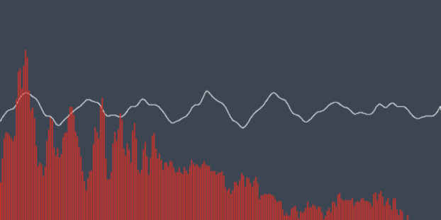
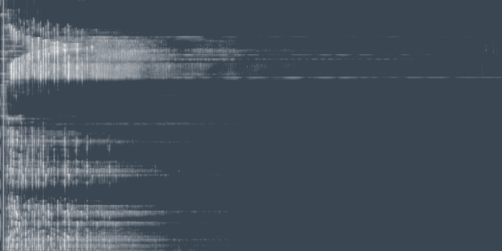
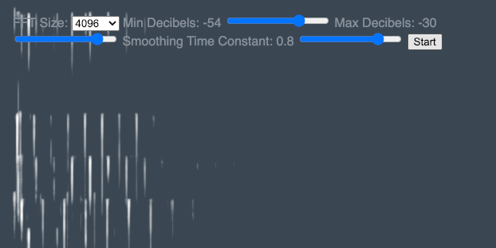
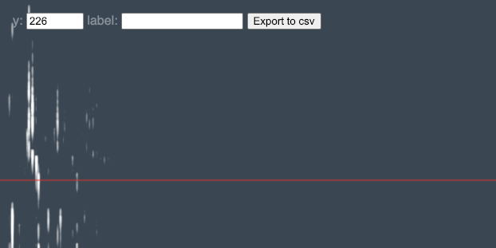

# AnalyserNode

A small collection of experiments with the AnalyserNode in the Web Audio Api.

[View the live demo here](https://remi-shergold.com/AnalyserNode/)

## Oscilloscope

Taken directly from [developer.mozilla.org "Visualizations with Web Audio API"](https://developer.mozilla.org/en-US/docs/Web/API/Web_Audio_API/Visualizations_with_Web_Audio_API) article. Uses `.getByteTimeDomainData()` to generate the waveform and `.getByteFrequencyData()` to generate the frequency bar chart.

## Spectrogram

A very basic spectrogram. Each row is one frame output of `.getByteFrequencyData()`.

## Spectrogram with knobs

A spectrogram with the four configurable properties of AnalyserNode exposed in the GUI. A good way to play with `.fftSize` `.minDecibels` `.maxDecibels` and `.smoothingTimeConstant` to get a feel for what they do.

## Spectrogram Explorer

This little tool allows you to stop the spectrogram. You can then navigate row by row - adding labels to any interesting rows. Values are viewable in the browser console or can be exported to a csv file.
